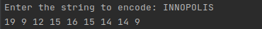

# String-Encoder


## Description

String Encoder is a tool that transforms a string into its reversed string with each letter coded with its alphabet position

## Screenshots
When executed, the program looks like the following illustration.



## Installation and usage guide
1. Make sure you have Python installed on your system:
    * For Linux: ```sudo apt-get install python3``` on Debian-based systems. If you have issues with the installation
    process, you can check this [tutorial](https://phoenixnap.com/kb/how-to-install-python-3-ubuntu). If you're on a different Linux ditribution,
      you can search for a tutorial specific to your distribution.
      
    * For Windows: You can follow this [guide](https://phoenixnap.com/kb/how-to-install-python-3-windows)
    
2. Download the content of this repo as a .zip file and extract it.
3. Open the terminal/command prompt in the folder where you extracted the .zip file. Run ```python3 main.py``` to start the program.
## Frameworks or technology
* Python3.8

## Features
* It works
* It supports upper and lower case letters.

## Code example
The main (and only) part of the project's source code is shown down below.
It shows the implemented steps for the string encoding process.
```python
print(" ".join(
    reversed([str(ord(x.upper())-ord('A')+1) 
              for x in str(input("Enter the string to encode: "))])))
```
## Credits
* RP Pvt limited
## License
* If you copy
